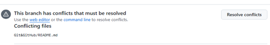
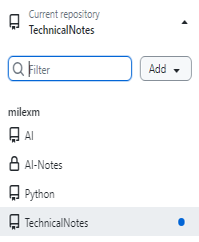
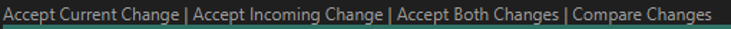
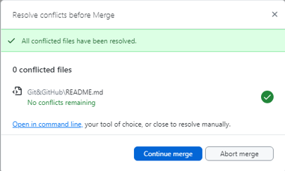

# GitHub error handling <!-- omit from toc -->

This topic looks at errors that you might encounter when using GitHub. It also shows the way to solve them. 

- [1. Branch conflicts](#1-branch-conflicts)
  - [1.1. Conflct resolution](#11-conflct-resolution)
- [2. References](#2-references)

## 1. Branch conflicts

One of the most common errors is the conflicting changes made to a file,
by different people and at the same time for example. When this happens,
if you try to create a pull reuest (PR), the GitHub app issues an error
saying: `This branch has conflicts that must be resolved` as shown in
the following figure.

### 1.1. Conflct resolution 

If the conflict is simple, the **Resolve conflicts** button is activated
otherwise, it is disabled. If the button is activated, you can select it
and resolve the error in the GitHub desktop. Another way, especially if
the conflict is complex, is to follow the steps described below. 

1. In GitHub desktop, in the left pane, select the repository.

    

2. In the drop-down menu, select the current repository.

    

3. In the popup dialog box select the button `Open in Visual Studio
   Code` to fix the conflicting problem.  
Visual Studio Code in this example is the default editor.  
   See also [Configuring a default editor in GitHub
   Desktop](https://docs.github.com/en/desktop/configuring-and-customizing-github-desktop/configuring-a-default-editor-in-github-desktop).  

     
4. The conflict errors are shown in VS Code as hown in the following picture.

4. The conflict errors are shown in VS Code as hown in the following picture. 
    

    The picture clearly shows the conflicts between the master repository content, titled `master (incoming change)` and the current change, titled `HEAD (current change)` in the branch. 
5. To solve the issues, select one of the links shown in the conflicting display. 

    
6. If the changes in the branch are correct, select `Accept Current Change`. Then save the changed file. 
7. In the GitHub desktop, in the popup dialog box, select the  `Continue merge` button. 

    
8. You may need to create a new pull request and close the old one. 

## 2. References

- [Configuring a default editor in GitHub Desktop](https://docs.github.com/en/desktop/configuring-and-customizing-github-desktop/configuring-a-default-editor-in-github-desktop)
- 