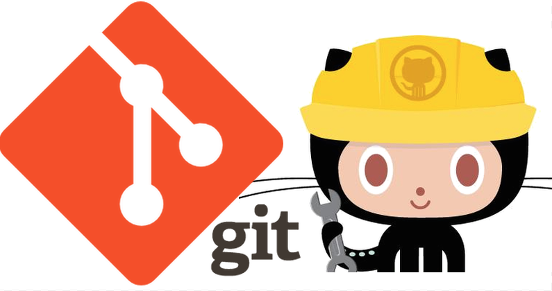
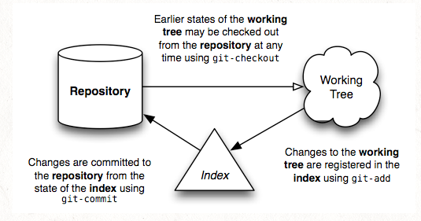

# Git <!-- omit from toc -->

**Git** is a revision control system, a **tool** to manage your source code history on your **local machine**. We'll talk about **GitHub** remote repository later.

> [!NOTE]
> In other words, **Git** allows you to create a **Version Control System** (VCS) for your software locally on your machine. You can keep it there and you do not even need any remote web service, like GitHub, to store your repositories in the cloud. But you should.



These notes which leverage many sources, listed in the References section attempt to explain Git in simple terms. The goal is to understand Git internals and its usage at a fundamental level.

If you are used to the SCM (Software Configuration Management) world, put that knowledge aside and start from a clean slate **'cause Git aint SCM**.

These notes explain Git basics. For information about GitHub, see [GitHub notes](github_notes.md).

> [!WARNING]
> **Git** is a revision control system, a **tool** to manage
> your source code history. **GitHub** instead is a hosting service for
Git repositories. They are not the same thing: Git is the tool, GitHub
is the service for projects that use Git.

- [1. Git overview](#1-git-overview)
- [2. Git architecture](#2-git-architecture)
  - [2.1. Git organization](#21-git-organization)
    - [2.1.1. Git repository (.git hidden folder)](#211-git-repository-git-hidden-folder)
      - [2.1.1.1. HEAD](#2111-head)
      - [2.1.1.2. refs](#2112-refs)
      - [2.1.1.3. objects](#2113-objects)
      - [2.1.1.4. config](#2114-config)
      - [2.1.1.5. hooks](#2115-hooks)
- [3. Core Git objects: blob, tree, and commit](#3-core-git-objects-blob-tree-and-commit)
  - [3.1. Relationship between blob, tree, and commit](#31-relationship-between-blob-tree-and-commit)
- [4. Examples of blob, tree, and commit](#4-examples-of-blob-tree-and-commit)
  - [4.1. Blob](#41-blob)
  - [4.2. Commit](#42-commit)
  - [4.3. Tree](#43-tree)
- [5. Git internals](#5-git-internals)
  - [5.1. Commit relationships](#51-commit-relationships)
  - [5.2. Role of tree objects](#52-role-of-tree-objects)
  - [5.3. Summary](#53-summary)
    - [5.3.1. Git commits trees blobs](#531-git-commits-trees-blobs)
      - [5.3.1.1. Diagram explanation](#5311-diagram-explanation)
      - [5.3.1.2. Git’s structure](#5312-gits-structure)
- [6. Git staging area (aka Index)](#6-git-staging-area-aka-index)
  - [6.1. How the staging area works](#61-how-the-staging-area-works)
  - [6.2. Why use the staging area?](#62-why-use-the-staging-area)
- [7. Glossary](#7-glossary)
- [8. References](#8-references)

## 1. Git overview

Git is an open source Version Control System (VCS) tool created by **Mr.
Linus Torvalds**. It stores and processes file content much differently
than other version control tools. Some of the information shown below
has been adapted fromn [Git Internals
PDF](https://github.com/pluralsight/git-internals-pdf/releases/tag/v2.0)
written by guru Scott Chacon.

See [How did Git get its name?](https://initialcommit.com/blog/How-Did-Git-Get-Its-Name).

According to Scott, Git is a **stupid content tracker**. It is a really
interesting file system, which tracks content (files and directories).
At its core t is a collection of simple tools that implement a tree
history storage and directory content management system. It is simply
used as an SCM, not really designed as one. For example, when most SCMs
store a new version of a project, they store the code delta or diff.

These notes which leverage many sources, listed in the Reference section, attempt to explain Git in simple terms. The goal is to understand Git internals and its usage at a fundamental level.
If you are used to the SCM (Software Configuration Management) world, put that knowledge aside and start from a clean slate **'cause Git aint SCM**.

> [!IMPORTANT] When Git stores a new version of a project, it stores a
> new tree, that contains a bunch of content blobs and a collection of
> pointers that can be expanded back into a full directory of files and
> subdirectories. If you want a diff between two versions, Git doesn’t
> add up all the deltas, it simply looks at the two trees and runs a new
> diff on them. This is what basically allows the system to be easily
> distributed by simply transfering all the directories and content from
> one user to another. Git is efficient about it. It only stores identical
> files and directories once and it can compress and transfer its content
> using delta-compressed packfiles. The following are the things that Git
> is very good at doing.

1. **Non linear development**

    Git is optimized for inexpensive and efficient branching and merging. It
    is built to be used simultaneously by many people, having multiple
    branches developed by individual developers, being merged, branched and
    re-merged constantly. Because of this, branching is incredibly
    inexpensive and merging is incredibly easy.

1. **Distributed development**

    Git is built to make distributed development simple. No repository
    is special or central in Git. Each clone is basically equal to
    another and could generally replace any other one at any time. It
    works completely offline or with hundreds of remote repositories
    that can push to and/or fetch from each other over several simple
    and standard protocols.

1. **Efficiency**

    Git is very efficient. Most operations are local, which reduces
    unnecessary network overhead. Repositories are generally packed very
    efficiently, which often leads to surprisingly small repo sizes.

## 2. Git architecture

Git is not a single binary, but a collection of small specialized
programs, which sometimes is annoying to people trying to learn Git, but
is very useful when you want to do anything nonstandard with it.

Install the Git command line tool. For information, see [Getting Started - Installing Git](https://git-scm.com/book/en/v2/Getting-Started-Installing-Git). 

> [!NOTE]
> Git is not a monolithic program but a toolkit whose components
> can be combined and chained to perform interesting taks.

For a long time, Git was just the raw toolkit and the project to wrap
those into a user friendly SCM was called Cogito. That project has since
been abandoned as Git itself became easier to use.

The tools can be more or less divided into two major categories, often
referred to as the porcelain and the plumbing.

1. The **plumbing porgrams** are not meant to be used via the command line, but rather to help performing tasks flexibly. They are combined by programs and scripts into porcelain programs.
1. The **porcelain programs** are largely what we are focusing on as user-oriented interfaces.

### 2.1. Git organization

Internally, Git (**.git**) repository has a very similar structure of a file system, shown in the figure below, with a couple of key differences.


- It represents file’s contents in **blobs**.
- The blobs are also leaf nodes in something very close to a directory, called a **tree**.
- A blob is uniquely identified by an ID number **defined by computing the SHA1 hash id of its size and contents**. This ID has two additional properties:
  - It verifies that the blob’s contents will never change.
  - The same contents shall always be represented by the same blob, no matter where it appears: across commits, across repositories, even across the whole Internet. It is an universal ID (GUID).

The following picture shows an example of the Git tree structure.


The difference between a Git **blob** and a filesystem’s file is that a blob **does not store metadata about its content**. The information is kept in the **tree** that holds the blob.

> [!IMPORTANT]
> A blob in a Git repository does not change. If you change the file in
> the working directory, the repositiory stores it as a different
> (immutable) blob with its unique ID. The fact that blobs are immutable
> in the Git repository is what makes the all thing works. As it turns
> out, this design allows for much more compact storage, since all
> objects having identical content can be shared, no matter where they
> are.

#### 2.1.1. Git repository (.git hidden folder)

Before we talk about some of the Git internals, let's look into the cornerstone of the Git system, which is the **,git hidden folder**.

When you start a new repository you execute the command shown below, in the directory that you selected as your repository.

    > git init

This command creates the **,git hidden folder** which contains all the current and future information for your repository. The following picture shows the folder's content. **This folder is the respository**.


Let's describe the folder's content.

##### 2.1.1.1. HEAD

The **HEAD** file is a simple text file that contains the **SHA hash** of the **commit that's currently checked out in your repository**. This file is used to keep track of your current branch, and it's updated automatically whenever you switch branches or checkout a specific commit.

> [!NOTE]
> [SHA](ttp://en.wikipedia.org/wiki/SHA1) stands for **Secure
> Hash Algorithm**. A SHA creates an identifier of fixed length that
uniquely identifies a specific piece of content. It is the most commonly
used algorithm.

##### 2.1.1.2. refs

The **refs folder is where Git stores references to commits and branches in your repository**. Inside this folder, you'll find a variety of subfolders that correspond to different types of references. For example, the heads subfolder contains references to the heads of branches in your repository, while the tags subfolder contains references to specific tags that you've created.

##### 2.1.1.3. objects

The **objects** folder is **where Git stores your codebase as a series of snapshots**. Each snapshot represents the state of your codebase at a specific point in time, and Git uses these snapshots to track changes to your code over time. Inside the objects folder, you'll find two subfolders: **pack** and **info**. The pack subfolder contains compressed snapshots of your codebase, while the info subfolder contains metadata about those snapshots.

##### 2.1.1.4. config

The **config** file is **where Git stores configuration information for your repository**. This file contains a variety of settings that control how Git behaves, such as your name and email address, the default branch for new checkouts, and the behavior of Git's merge and diff tools.

##### 2.1.1.5. hooks

The **hooks** folder is **where you can add custom scripts that run at specific points in the Git workflow**. For example, you can add a script that runs before each commit to ensure that your code meets certain quality standards, or a script that runs after each checkout to set up your development environment.

## 3. Core Git objects: blob, tree, and commit

Git manages your repository using three fundamental object types: **blob**, **tree**, and **commit**.

> [!IMPORTANT]
> These objects work together to represent the state of your project and its history.

1. **Blob** (Binary Large Object)

   - Purpose: Stores the content of a file as raw data.
   - Key Properties:
        - Does not store file names or metadata.
        - Identified by a SHA-1 hash.
        - Represents the content of a single file at a specific point in
          time.

1. **Tree**

   - Purpose: **Represents a directory and its structure**.
   - Key Properties:
      - Contains references to blobs (files) and other tree objects
        (subdirectories).
      - Each entry includes:
        - File mode (permissions).
        - Object type (blob or tree).
        - SHA-1 hash.
        - File or directory name.
   - Encapsulates the state of a directory at a given moment.
  
1. **Commit**

    - Purpose: Represents a **snapshot of the repository at a point in time**.
    - Key Properties:
      - **Points to a tree object** (directory structure of the project)
      - Contains metadata like:
        - Author, committer, and commit message.
        - Parent commits (for tracking history).
    - Each commit records changes by referencing a specific tree object.


### 3.1. Relationship between blob, tree, and commit

Summarizing: 

- **Blob**: Represents the content of individual files.
- **Tree**: References blobs and other tree objects to construct a hierarchical directory structure.
- **Commit**: References a tree object to capture the state of the repository at that commit.

This is a typical structure:

    Commit
    |
    └── Tree
         ├── Blob (file1.txt)
         ├── Blob (file2.txt)
         └── Tree (subdirectory)
               ├── Blob (subfile1.txt)
               └── Blob (subfile2.txt)

For more information, see  [Git internals](#5-git-internals)

## 4. Examples of blob, tree, and commit

Let's get a better handle of the concepts described so far. Let's create
a sample Git repository, and show how Git works from the bottom up. For
more information, see [Git from the bottom
up](https://jwiegley.github.io/git-from-the-bottom-up/). To make the
things simple, let's start a new repository locally on your computer.

### 4.1. Blob

Starting from scratch, first you create a new repository in the directory where your project (files) are located. For more information, see [Git Basics - Getting a Git Repository](https://git-scm.com/book/en/v2/Git-Basics-Getting-a-Git-Repository).

> [!NOTE] The following code example uses the Markdown syntax to display
> code blocks. To create a code block you must enter four spaces or one
> tab in relation to the previous block. For more information, see [How
> do you add code blocks in
> Markdown?](https://itsfoss.com/markdown-code-block/).

1. Create a repository.

        > cd C:/GitHub/milexm
        > mkdir Git-Basics
        > cd Git-Basics
        > git init

    The `git init` command initializes an empty Git repository in `C:/GitHub/milexm/Git-Basics/.git/`. **Where the `.git` folder is the repository**.

1. Create a greetings text file.

        > echo 'Hello, world!' > greetings

    Let's calculate the blob ID (SHA1 ID) of the file.

        > git hash-object greetings
        5f831d630dd069aca58b3a164ff526b53c142456
1. Let's change the greetings text file.

        > echo 'Hello, WORLD!' > greetings

    Let's calculate the blob ID (SHA1 ID) of the file. Obviously, if you
    change the file content, the ID will be different, because the file
    content is different as shown in this example.

        > git hash-object greetings
        ed059abde7c93586fa6d729a31ef4bea628f37c4

  > [!IMPORTANT]
  > As you can see, the SHA1 ID has changed, because the file content
  is changed. This is crucial for Git to wotk. Git uses the SHA1 IDs
  to keep track of the blobs. Remember the hash ID is globally unique
  because based on the file content. In other words, if the file
  resides on my machine, or on yours, or in GitHub its SHA ID is
  always the same and refers always to the same file. It is the file
  **fingerprint**.

### 4.2. Commit

 Let's now add the `greetings` file to the repository.

1. Add the `greetings` file to the repository.

        > git add greetings
        > git commit -m "my first commit"
        [master (root-commit) f4c6f01] my first commit
        1 file changed, 1 insertion(+)
        create mode 100644 greetings

1. Let's find out the objects that have been stored.

       > dir .git\objects /S /B | sort
        GitHub\milexm\Git-Basics\.git\objects\1a
        e113f586493efb81aea6547c71e046850adee
        GitHub\milexm\Git-Basics\.git\objects\ed
        059abde7c93586fa6d729a31ef4bea628f37c4
        GitHub\milexm\Git-Basics\.git\objects\f4
        c6f013c39854b93aa4290facd82731beed0ae4
        GitHub\milexm\Git-Basics\.git\objects\info
        GitHub\milexm\Git-Basics\.git\objects\pack

1. Let's check what kind of objects have been stored. Note thet the
   first 2 digits refer to the directory where the object is stored, the
   reminders identify the object itself.

        > git cat-file -t 1a1e113f586493efb81aea6547c71e046850adee
        tree
        > git cat-file -t ed059abde7c93586fa6d729a31ef4bea628f37c4
        blob
        > git cat-file -t f4c6f013c39854b93aa4290facd82731beed0ae4
        commit

As a convenience, Git requires only as many digits of the object hash id
as are necessary to uniquely identify it within the repository. Usually
just six or seven digits suffce. See the following example:

        > git cat-file -t ed059ab
        blob

1. Display the blobb content.

        > git cat-file blob ed059ab
        'Hello, WORLD!'

    As you can see the blob is in the repository and it contains the
    content we expected. It will always have this same identifier, no
    matter how long the repository lives or where the file within it is
    stored. This particular content is now verifiably preserved,
    forever.

> [!IMPORTANT] Git blob represents the fundamental data unit in
> Git.Really, the whole **Git system is about blob management**.

The **commit** object contains the directory tree object hash, parent
commit hash, author, committer, date and message as shown next:

    > git log
    commit f4c6f013c39854b93aa4290facd82731beed0ae4 (HEAD -> master)
    Author: integrated Git <milexm@gmail.com>
    Date:   Sun Dec 1 18:45:06 2024 -0800
    my first commit

> [!NOTE]
> Every commit holds a single tree which is linked to its parent commit.

### 4.3. Tree

The file contents are stored in blobs, which are featureless. They have
no name, no structure. They are “blobs”, after all.

In order to represent the structure and naming of files, Git attaches
these blobs to a tree as leaf nodes. Let's see where the blob we created
lives. Here we go.

    > git ls-tree HEAD
    100644 blob ed059abde7c93586fa6d729a31ef4bea628f37c4    greetings

The first commit added the greetings file to the repository. The commit
contains one tree, which has a single leaf that is the greetings content
blob.  

Although we can look at the tree containing the blob by passing HEAD to
ls-tree, we haven’t yet seen the underlying tree object referenced by
that commit. Here are a few other commands to discover the tree.

1. Decode the HEAD alias of the commit it references.

        git rev-parse HEAD
        f4c6f013c39854b93aa4290facd82731beed0ae4

1. Verify the type of HEAD alias.

        > git cat-file -t HEAD
        commit

1. Get the hash ID of the tree held by the commit, as well as other info
   stored in the commit object.

        > git cat-file commit HEAD
        tree 1a1e113f586493efb81aea6547c71e046850adee
        author integrated Git <milexm@gmail.com> 1733107506 -0800
        committer integrated Git <milexm@gmail.com> 1733107506 -0800

    Note tha the hash ID of the commit is unique to my repository
    because it includes my name and the date of the commit. But the hash
    ID of the tree is always the same. Let's verify it:

        > git ls-tree 1a1e113f
        100644 blob ed059abde7c93586fa6d729a31ef4bea628f37c4    greetings

    As you can see the repository contains a single commit, which
    references a tree that holds a blob containing the recorded content.

## 5. Git internals

Git manages a repository using three fundamental object types: **blob**,
**tree**, and **commit**. 

> [!IMPORTANT]
> These objects work together to represent the state of
your project and its history.

Let's aaume that we have two files; `greetings.txt` and `walk.txt`, and
we have made three commits so far. The following is the snapshot of the
repository.

    Commit 1
    |
    v
    Tree 1
    |
    +-- Blob v1 (greetings.txt)
    +-- Blob v1 (walk.txt)
    |
    +-- Commit 2
            |
            v
        Tree 2
            |
            +-- Blob v2 (greetings.txt)
            +-- Blob v2 (walk.txt)
            |
            +-- Commit 3 (master)
                |
                v
            Tree 3
                |
                +-- Blob v3 (greetings.txt)
                +-- Blob v3 (walk.txt)
                |
                HEAD -> master -> Commit 3

This structure clearly shows the lineage of commits:

- Commit 1 points to Tree 1, which contains Blob v1 for both
  `greetings.txt` and `walk.txt`.
- Commit 2 is connected to Tree 2, which has Blob v2 versions.
- Commit 3 (the master branch) points to Tree 3, with Blob v3 versions.

This properly visualizes that Commit 2 follows Commit 1 and Commit 3
follows Commit 2, all while HEAD is at Commit 3.

### 5.1. Commit relationships

1. **Commit 1 and Commit 2**

    Commit 2 is the child of Commit 1. It references Commit 1 as its
    parent. This relationship is established when a new commit is
    created after making changes to the repository. Commit 2 builds on
    the state of Commit 1, recording what has changed.

1. **Commit 2 and Commit 3**

    Similarly, Commit 3 is the child of Commit 2 and references Commit 2
    as its parent.

The sequence **Commit 1 -> Commit 2 -> Commit 3** represents the history of
changes in the repository. Each commit contains:

- A reference to its parent (except for the initial commit).
- A snapshot of the repository state in the form of a tree object.

### 5.2. Role of tree objects

Tree objects are **snapshots** of the directory structure at the time of a
commit. Each commit points to a tree object that represents:

- The **state of the files in the repository** at that commit.
- The paths, filenames, and references to blobs (file contents) or
subtrees (subdirectories). For example:

- Tree 1: Represents the directory structure and file content (Blob v1
  for greetings.txt and walk.txt) as recorded in Commit 1.
- Tree 2: Represents the updated state of the directory after Commit 2.
  If greetings.txt and walk.txt were modified, Tree 2 points to Blob v2
  versions of these files.
- Tree 3: Represents the final state of the directory after Commit 3,
  with Blob v3 versions of the files.

### 5.3. Summary

1. Commits form a chain

   - Each commit references a parent commit, creating a linear history
     (or branching if needed).
   - Commits store a pointer to a tree object that reflects the
     repository state at that moment.

1. Tree objects define the state

   - Each tree object represents the directory structure and file
     contents as blobs at a specific point in time.

1. Blobs hold the file contents

   - Blobs are the actual data objects for the files. Different versions
     of a file (v1, v2, v3) are stored as separate blobs.

This structure ensures Git efficiently tracks changes by referencing
**immutable** objects, enabling powerful features like **branching**,
**merging**, and **rebasing**.

#### 5.3.1. Git commits trees blobs

The following picture shows a Git repository. The diagram illustrates the commit history; how Git structures commits, trees, blobs, and subtrees across four commits. Each change and reuse of objects is explicitly explained.

```

Commit 4 (HEAD, master)
|
|-- Tree4
|    |
|    |-- file1.txt (Blob2)          <-- Changed in Commit2
|    |-- file2.txt (Blob5)
|    |-- file3.txt (Blob3)
|    |
|    |-- assets/ (Tree5)            <-- New in Commit2
|    |    |
|    |    |-- image1.png (Blob4)
|    |
|    |-- docs/ (Tree6)              <-- New in Commit3
|         |
|         |-- readme.txt (Blob7)    <-- Changed in Commit4
|
Commit 3
|
|-- Tree3
|    |
|    |-- file1.txt (Blob2)
|    |-- file2.txt (Blob5)
|    |-- file3.txt (Blob3)
|    |
|    |-- assets/ (Tree5)            <-- Unchanged from Commit2
|    |    |
|    |    |-- image1.png (Blob4)
|    |
|    |-- docs/ (Tree6)              <-- New in Commit3
|         |
|         |-- readme.txt (Blob6)
|
Commit 2
|
|-- Tree2
|    |
|    |-- file1.txt (Blob2)          <-- Changed in Commit2
|    |-- file2.txt (Blob5)          <-- Changed in Commit2
|    |-- file3.txt (Blob3)
|    |
|    |-- assets/ (Tree5)            <-- New in Commit2
|         |
|         |-- image1.png (Blob4)
|
Commit 1
|
|-- Tree1
     |
     |-- file1.txt (Blob1)
     |-- file2.txt (Blob2)
     |-- file3.txt (Blob3)

```

##### 5.3.1.1. Diagram explanation

1. **Commit 1**
   - Contains 3 text files (`file1.txt`, `file2.txt`, and `file3.txt`).
   - Each file points to its respective blob (Blob1, Blob2, Blob3).

2. **Commit 2**:
   - Updates `file1.txt` and `file2.txt`, creating new blobs (Blob2 and Blob5).
   - Adds a new directory `assets/` containing `image1.png` (Blob4).

3. **Commit 3**:
   - Keeps all existing files unchanged.
   - Adds a new directory `docs/` containing `readme.txt` (Blob6).

4. **Commit 4**:
   - Keeps all files unchanged except for `readme.txt` in the `docs/` directory.
   - Updates `readme.txt` to a new blob (Blob7).

##### 5.3.1.2. Git’s structure

- **Blobs**: Represent the content of individual files. A new blob is created only if a file’s content changes.
- **Trees**: Represent directories and their structure (including references to blobs and subtrees).
- **Commits**: Represent snapshots of the project state, pointing to a single tree.

This diagram shows how Git efficiently reuses blobs and trees to minimize storage redundancy.

For more information, see [Git Internals - Git Objects](https://git-scm.com/book/en/v2/Git-Internals-Git-Objects).

## 6. Git staging area (aka Index)

The Git **staging area** (also called the **index**) is a middle layer in the Git workflow that sits **between your working directory and your repository**. It plays a critical role in tracking and preparing changes for commits.

### 6.1. How the staging area works

- **Working Directory**. The place where you make changes to your files.
  Files in this state are untracked or modified.
- **Staging Area**. A temporary storage area where you can group changes
  that will be included in your next commit. Files are staged here.
- **Repository**. The final destination for your changes when you create
  a commit. Files here are committed.

After creating a repository, you do your work in the working tree. Once
your work reaches a significant point, you add your changes successively
to the index (stage). Once the index contains everything you intend to
commit, you record its content in the repository. Here’s a simple
diagram that shows a typical project’s life-cycle:



### 6.2. Why use the staging area?

- **Select Specific Changes**. Allows you to choose exactly which
  changes to include in a commit, even if other changes exist in your
  working directory.
- **Prepare Commits Gradually**. Lets you stage changes incrementally,
  ensuring commits are meaningful and focused.
- R**eview Changes**. Gives you an opportunity to inspect staged changes
  before finalizing them into a commit.
  
## 7. Glossary

- **Working tree**. A working tree is **any directory on your filesystem
  which has a repository associated with it**, typically indicated by
  the presence of a sub-directory within it named **.git.**. It includes
  all the files and sub-directories in that directory.
- **Repository**. It is a collection of commits, each of which is an
  archive of what the project’s working tree looked like at a past date,
  whether on your machine or someone else’s. It also defines the
  **HEAD** which identifies the branch or commit the current working
  tree originated from. Lastly, it contains a set of branches and tags,
  to identify certain commits by name.
- **HEAD**. It is used by the repository to define what is currently
  checked out, specifically:
  - If you checkout a branch, the HEAD symbolically refers to that
    branch, indicating that the branch name should be updated after the
    next commit operation.
  - If you checkout a specific commit, HEAD refers to that commit only.
    This is referred to as a detached HEAD, and occurs, for example, if
    you check out a tag name.
- **Commit**. A commit is a snapshot of your working tree at some point
  in time. The state of the HEAD at the time your commit is made becomes
  that commit’s parent. This is what creates the notion of a **revision
  history**.
- **Branch**. A branch is just a name for a commit. It is also called a
  reference. It is the parentage of a commit which defines its history,
  and thus the typical notion of a “branch of development”.
- **Tag**. A tag is also a name for a commit, similar to a branch, but
  it always refers to the same commit. It can have its own description
  text.
- **Index**. Git does not commit changes directly from the working tree
  into the repository. Instead, it registers them in the **index**. It
  is a way of “confirming” your changes, one by one, before doing a
  commit, which records all your approved changes at once. Some call it
  the **staging area**, instead.
- **Master**. The mainline of development in most repositories is done
  on a branch called “**master**”. Although this is a typical default,
  there is nothing special about this branch.
- **Origin**.  It is a shorthand name for the remote repository that a
  project was originally cloned from. More precisely, it is used instead
  of that original repository's URL and thereby makes referencing much
  easier.

## 8. References

- [Git official documnetation](https://git-scm.com/doc)
  - [Pro Git](https://git-scm.com/book/en/v2) - The book online
    - [Getting Started - What is Git?](https://git-scm.com/book/en/v2/Getting-Started-What-is-Git). Git official documentation - must read.
  - [Git Videos](https://git-scm.com/videos)
  - [Git References](https://git-scm.com/docs)
- [Git Internals PDF](https://github.com/pluralsight/git-internals-pdf/releases/tag/v2.0). Source code control and beyond by guru Scott Chacon.
- [Git Cheat Sheet](https://about.gitlab.com/images/press/git-cheat-sheet.pdf)

  <!-- more links -->

- [A Visual Git Reference](https://marklodato.github.io/visual-git-guide/index-en.html). This page gives a brief, visual reference for the most common commands in git.
- [Git from the bottom up](https://jwiegley.github.io/git-from-the-bottom-up/). Advance your understanding of Git and the simplicity underlying it.
- [Git How To](https://githowto.com/). Understand by doing.
- [Intro to Git and GitHub](https://product.hubspot.com/blog/git-and-github-tutorial-for-beginners). Intro to Git and GitHub for Beginners.
- [Git guide](https://github.com/git-guides)
- [Understanding the contents of the .git folder](https://dev.to/rajaniraiyn/understanding-the-contents-of-the-git-folder-ef)
- [On git and usability](https://blog.nelhage.com/2010/01/on-git-and-usability/)
