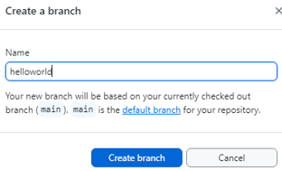

# GitHub <!-- omit from toc -->

[GitHub](https://github.com/) is a hosting service for Git repositories. It is a hosting platform for version control and collaboration. It allows people to work on common projects from everywhere.

> [!IMPORTANT] 
> **Git** is a revision control system, a **tool** to manage source code
> history. **GitHub** instead is a hosting service for Git repositories.
> They are not the same thing: Git is the tool, GitHub is the service
for projects that use Git.

- [1. GitHub getting started](#1-github-getting-started)
  - [1.1. Create a Git repository](#11-create-a-git-repository)
- [2. Create a branch](#2-create-a-branch)
  - [2.1. Commit changes](#21-commit-changes)
  - [2.2. Open a Pull Request](#22-open-a-pull-request)
  - [2.3. Merge Pull Request](#23-merge-pull-request)
- [3. TBD](#3-tbd)
- [4. References](#4-references)

## 1. GitHub getting started

You use Git to manage your repositories, . We reccomend you use the GitHub desktop client. Install the GitHub GUI client from this location: [GitHub Desktop](https://desktop.github.com/). This tool provides a very friendly GUI and seamless integration with your GitHub repositories. So, go for it!! 
For more information, see [GitHub Desktop Documentation](https://help.github.com/en/desktop).

Alternatively, you can install the Git command line tool, refer to [Getting Started - Installing Git](https://git-scm.com/book/en/v2/Getting-Started-Installing-Git). But it has a steep learning curve. See also [Git](git.md). 

### 1.1. Create a Git repository

A repository is usually used to organize a single project. Repositories
can contain folders and files, images, videos, spreadsheets, and data
sets; anything your project needs. It is recommended to include a
README, or a file with information about your project. GitHub makes it
easy to add one at the same time you create your new repository. It also
offers other common options such as a license file.

1. Activate the Git client.
1. From the **File** drop-down menu, select **New Repository**

    

1. In the popup dialog window enter the required information, name the repository *Greetings*. Enter the additional info. The following picture shows an example.

    

1. Select the **Create repository** button. This is an example of the results. 

    

1. Click the **preferences** link and enter your GitHub account information. For more information, see [Configuring Git for GitHub Desktop](https://help.github.com/en/desktop/getting-started-with-github-desktop/configuring-git-for-github-desktop).

1. Configure your default editor. We have selected *VS Code* for our examples, as shown in the next picture. For more information, see [Configuring a default editor in GitHub Desktop](https://docs.github.com/en/desktop/configuring-and-customizing-github-desktop/configuring-a-default-editor-in-github-desktop)

1. Publish the repository. 

    

The Hello World project is a simple exercise that gets you started when
learning something new. Let’s get started with GitHub! For more info,
see [Hello World](https://guides.github.com/activities/hello-world/).
This example uses GitHub which is a code hosting platform for version
control and collaboration. It allows people to work on common projects
from everywhere.

## 2. Create a branch

Branching is the way to work on different versions of a repository at one time.
By default the repository has one branch named **master** which is considered to be the definitive branch.

Let's use branches to experiment and make edits before committing them to master.

1. Go to the repository **Greetings**, we created earlier. 
1. In the top menu bar, select **Branch** and in the drop-down select **New branch**. 

    

1. In the popup window enter the branch name *helloworld*, Select the **Create branch**.  

    

    The new branch is created as shown in the following figure. 

    

1. Select **Publish branch** to store it in the remote repository. 

### 2.1. Commit changes

Let’s make some edits in the *helloworld* branch.

1. In your browserm, go to the *Greetings* repository.
1. In the selection bar, select **2 Branches**.
    
    > ![NOTE]
    > It says *2 Branches* because main is considered a branch too. 
1. In the list of active branch, select **helloworld**.

   

1. Select the `Readme.md` file and add *Hello World!*.
1. Select the **Commit changes** button. 
1. In the popup window, add a comment, then select **Commit changes**.

    

These changes are made only in the `README.md` file in the *helloworld* branch, so now this branch contains content that’s different from that in the `master`.

### 2.2. Open a Pull Request

Now that we have changes in a branch off of master, you can **open a pull request**.

**Pull Requests** are the heart of collaboration on GitHub.

When you open a pull request, you’re proposing your changes and requesting that someone review and pull in your contribution and merge them into their branch.
Pull requests show diffs, or differences, of the content from both branches. The changes, additions, and subtractions are shown in green and red.

Note the following:

1. As soon as you make a commit, you can open a pull request and start a discussion, even before the code is finished.
1. By using GitHub’s `@mention system` in your pull request message, you can ask for feedback from specific people or teams, whether they’re down the hall or 10 time zones away.
1. You can even open pull requests in your own repository and merge them yourself. It’s a great way to learn the GitHub flow before working on larger projects.

Let's see how it is done:

1. While in the *README* file, in the *readme-edits* branch, click the **Pull Request** tab at the very top.
1. Click the **New pull request** button.  
1. In the **Example Comparisons** box, select the branch you made, *readme-edits*, to compare with master (the original).
1. Look over your changes in the diffs on the **Comparing changes** page, assure that they are what you want to submit.
1. When you’re satisfied, click the **Create Pull Request** button in the top left. To discuss and review the changes in this comparison with others.
1. Give your pull request a title and write a brief description of your changes.
1. Click the **Create pull request** button at the bottom of the page.

### 2.3. Merge Pull Request

In this final step, it’s time to bring your changes together by merging your *readme-edits* branch into the *master* branch.

1. Click the green **Merge pull request** button to merge the changes into master.
1. Click **Confirm** merge.
1. Go ahead and delete the branch, since its changes have been incorporated, with the **Delete branch** button in the purple box.

To learn more about the power of **Pull Requests**, we recommend reading the [GitHub flow Guide](http://guides.github.com/overviews/flow/). You might also visit [GitHub Explore](http://github.com/explore) and get involved in an Open Source project.

Check out our other [Guides](http://guides.github.com/), [YouTube Channel](http://youtube.com/githubguides) and [On-Demand Training](https://services.github.com/on-demand/) for more on how to get started with GitHub.

## 3. TBD 

## 4. References

- [GitHub Desktop](https://desktop.github.com/) 
  - [GitHub Desktop Documentation](https://help.github.com/en/desktop)
  - [About GitHub Desktop](https://docs.github.com/en/desktop/overview/about-github-desktop)
  - [Configuring Git for GitHub Desktop](https://help.github.com/en/desktop/getting-started-with-github-desktop/configuring-git-for-github-desktop)
  - [Configuring a default editor in GitHub Desktop](https://docs.github.com/en/desktop/configuring-and-customizing-github-desktop/configuring-a-default-editor-in-github-desktop)
- [Hello World](https://guides.github.com/activities/hello-world/)
