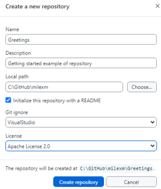

# GitHub <!-- omit from toc -->

[GitHub](https://github.com/) is a hosting service for Git repositories. It is a hosting platform for version control and collaboration. It allows people to work on common projects from everywhere.

> [!IMPORTANT] 
> **Git** is a revision control system, a **tool** to manage source code
> history. **GitHub** instead is a hosting service for Git repositories.
> They are not the same thing: Git is the tool, GitHub is the service
for projects that use Git.

- [1. GitHub getting started](#1-github-getting-started)
  - [1.1. Create a local Git repository](#11-create-a-local-git-repository)

## 1. GitHub getting started

You use Git to manage your repositories, . We reccomend you use the GitHub desktop client. Install the GitHub GUI client from this location: [GitHub Desktop](https://desktop.github.com/). This tool provides a very friendly GUI and seamless integration with your GitHub repositories. So, go for it!! 
For more information, see [GitHub Desktop Documentation](https://help.github.com/en/desktop).

Alternatively, you can install the Git command line tool, refer to [Getting Started - Installing Git](https://git-scm.com/book/en/v2/Getting-Started-Installing-Git). But it has a steep learning curve. See also [Git](git.md). 

### 1.1. Create a local Git repository 

1. Activate the Git client.
1. From the **File** drop-down menu, select **New Repository**

    

1. In the popup dialog window enter the required information. 

    

1. Select the **Create repository** button. This is an example of the results. 

    

1. Click the **preferences** link and enter your GitHub account information. For more information, see [Configuring Git for GitHub Desktop](https://help.github.com/en/desktop/getting-started-with-github-desktop/configuring-git-for-github-desktop).

1. Configure your default editor. We have selected *VS Code* for our examples, as shown in the next picture. For more information, see 

1. Publish the repository. 

    