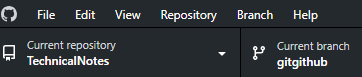
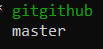

# GitHub error handling <!-- omit from toc -->

This topic looks at errors that you might encounter when using GitHub. It also shows the way to solve them. 

- [1. Branch conflicts](#1-branch-conflicts)
  - [1.1. Conflct resolution](#11-conflct-resolution)
- [2. Resolve conflicts via command line](#2-resolve-conflicts-via-command-line)
- [3. References](#3-references)

## 1. Branch conflicts

One of the most common errors is the conflicting changes made to a file,
by different people and at the same time for example. When this happens,
if you try to create a pull reuest (PR), the GitHub app issues an error
saying: `This branch has conflicts that must be resolved` as shown in
the following figure.

### 1.1. Conflct resolution 

If the conflict is simple, the **Resolve conflicts** button is activated
otherwise, it is disabled. If the button is activated, you can select it
and resolve the error in the GitHub desktop. Another way, especially if
the conflict is complex, is to follow the steps described below. 

1. In GitHub desktop, in the left pane, select the repository.

    

2. In the drop-down menu, select the current repository.

    

3. In the popup dialog box select the button `Open in Visual Studio
   Code` to fix the conflicting problem.  
Visual Studio Code in this example is the default editor.  
   See also [Configuring a default editor in GitHub
   Desktop](https://docs.github.com/en/desktop/configuring-and-customizing-github-desktop/configuring-a-default-editor-in-github-desktop).  

     
4. The conflict errors are shown in VS Code as hown in the following picture.

4. The conflict errors are shown in VS Code as hown in the following picture. 

    

    The picture clearly shows the conflicts between the master repository content, titled `master (incoming change)` and the current change, titled `HEAD (current change)` in the branch. 
5. To solve the issues, select one of the links shown in the conflicting display. 

    

6. If the changes in the branch are correct, select `Accept Current Change`. Then save the changed file. 

7. In the GitHub desktop, in the popup dialog box, select the  `Continue merge` button. 

    
8. You may need to create a new pull request and close the old one. 

## 2. Resolve conflicts via command line

Follow the steps described below to resolve conflicts via command line. The steps are listed in the GitHub desktop suggestion box.

1. `git pull origin master`

    The command perform the following actions.

    - **Fetches changes from the remote repository**

        It contacts the remote repository named origin and fetches the latest changes from the branch master.

    - **Merges changes into your current branch**

        After fetching, it merges the changes from origin/master into your current branch (which is typically also master).

        This is essentially a shorthand for running the following two commands:

            git fetch origin master
            git merge origin/master

        **Key Concepts**

        - `origin`. The default name for the remote repository you cloned or connected to.
        - `master`. The name of the branch being pulled (commonly the default main branch in older Git repositories; newer ones often use main).
        - `Pull`. Combines fetch (to get updates) and merge (to integrate those updates) into a single command.

        **Considerations**

        - If there are conflicts between your local changes and the remote changes, Git will pause the process and ask you to resolve the conflicts before completing the merge.
        - To avoid an automatic merge and review changes manually, you can use `git fetch` and `git merge` separately.

        **Alternative**

        If you want to rebase instead of merge, you can execute the following command:

            git pull --rebase origin master
            
        This applies the changes from origin/master on top of your current branch, creating a linear history. 

1. `git checkout gitgithub`

    The command performs a branch or commit switch in a Git repository. What happens depends on whether `gitgithub` refers to an existing branch, a tag, or a commit. 

   - `gitgithub` is a **branch**.

       Git switches your working directory to the branch `gitgithub` and updates all files to match its state.
       In the example `gitgithub` is a branch.

       

       **Example**

       If you previously worked on the main branch, this command switches to the branch named `gitgithub`.

   - `gitgithub` is a **tag**

       Git checks out the specific **commit** associated with the tag gitgithub.
       This puts your working directory in a "**detached HEAD**" state, meaning you are not on a branch.

   - `gitgithub` is a **commit hash**

       Git switches your working directory to the specified commit, again in a "**detached HEAD**" state. Any changes you make will not affect any branch unless you explicitly create a new branch or reattach to an existing one.

        You can verify if gitgithub is a branch or tag using the following commands:

            git branch --list gitgithub
            git tag --list gitgithub

        In our example, the first command outputs the following:

        

1. `git merge master`

    The command merges changes from the branch named **master** into the branch you're currently working on.

    - **Current branch context**

        Ensure you are on a branch where you want the master branch's changes to be applied. For example, if you're on a feature branch (feature-xyz), running this command will merge master into feature-xyz.

    - **Merge process**

      - Git compares the current branch's state with master and identifies the commits on master that are not already in the current branch.
      - These changes are applied to the current branch.

    - **Merge scenarios**

        - **Fast-forward merge**
            If the current branch is directly behind master and has no divergent changes, Git will simply move the branch pointer forward.
        - **Three-Way merge**
            If both branches have unique changes, Git creates a new merge commit that combines changes from both branches.
        - **Merge conflicts**
            If changes overlap in the same file, Git pauses the merge and marks conflicts for manual resolution.

## 3. References

- [Configuring a default editor in GitHub Desktop](https://docs.github.com/en/desktop/configuring-and-customizing-github-desktop/configuring-a-default-editor-in-github-desktop)
- 