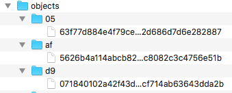

<link href="../Css/custom.css" rel="stylesheet"></link>

  

  

# Git Notes
<b>Git</b> is a revision control system, a <b>tool</b> to manage your source code history on your local machine. 

Git has a pretty steep learning curve compared to many other systems. It is a painstaking process!!

These notes which leverage many sources, listed in the [References](#ref) section attempt to explain Git in simple terms. The goal is to understand Git internals and its usage at a fundamental level. 
If you are used to the SCM (Software Configuration Management) world, put that knowledge aside and start from a clean slate 'cause Git aint SCM. 

These notes explain Git basics. For more information about GitHub, see [GitHub Notes](GitHubNotes.md). 

<b>Git</b> is a revision control system, a <b>tool</b> to manage your source code history. <b>GitHub</b> is a hosting service for Git repositories.
They are not the same thing: Git is the tool, GitHub is the service for projects that use Git.

To shorten your GitHub address go to [https://git.io/](https://git.io/). 

 

## Table of Content

- [Git Getting Started](#git)
- [What is Git?](#git?)
- [Git Internals](#git_intern)
- [Git Branches](#branches)
- [Glossary](#glos)
- [References](#ref)
- [Appendix](#appendix)
	- [Appendix A - Git Command Line](#appendixa)  

## Git Getting Started
<b>Git</b> is a revision control system, a <b>tool</b> to manage your source code history

The first steps you want to perform is to install **Git**.  

1. We reccomend you install the GitHub Desktop client from this location: [GitHub Desktop](https://desktop.github.com/). This tool provides a very friendly GUI and a seamless integration with your GitHub repositories. So, go for it!! For more information, see [GitHub Desktop Documentation](https://help.github.com/en/desktop).
1. Alternatively, you can install the Git command line tool, refer to [Getting Started - Installing Git](https://git-scm.com/book/en/v2/Getting-Started-Installing-Git). 

#### Create a Local Git Repository via GitHub Desktop 
1. Activate the Git Desktop client.
1. From the File drop-down menu, select **Create a New Repository**
1. In the popup dialog window enter the required information. 
1. Click the **Create Repository** button. 
1. Click the **preferences** link and enter your GitHub account information. For more information, see
<a href="https://help.github.com/en/desktop/getting-started-with-github-desktop/configuring-git-for-github-desktop">Configuring Git for GitHub Desktop</a>.
6. Configure your default editor. We have selected *VS Code* for our examples. For more information, see 
<a href="https://help.github.com/en/desktop/getting-started-with-github-desktop/configuring-a-default-editor">Configuring a default editor</a>.

#### Publish Local Git Repository to GitHub 

1. If not done yet, click the **preferences** link and enter your GitHub account information. For more information, see [Configuring Git for GitHub Desktop](https://help.github.com/en/desktop/getting-started-with-github-desktop/configuring-git-for-github-desktop).
1. In the right pane, click the **Publish repository** button. 
1. In the popup dialog, uncheck *Keep this code private*, if you wish; click the **Publish repository** button. 
1. Click the **View on GitHub** button to verify that the repo has been created in GitHub. 

#### Add information to README.md 
1. In your favorite markdown editor, edit the **README.md** file and add meaningful information about the project. 
I use [MacDown](https://macdown.uranusjr.com/) as the markdown editor on a Mac laptop.

2. In your Git client you will see in green the content added to the file. Verify that everything is correct.
3. In the left pane, add a comment about the changes you made.
4. Click the **Commit to master** button. 
5. In the right pane, click the **Push origin** button. This publishes the file to your GitHub repository.  

## What is Git?
Git is an open source Version Control System (VCS) tool created by **Mr. Linus Torvalds**. It stores and processes file content much differently than other version control tools. Some of the information you read next has been adapted fromn 
[Git Internals PDF](https://github.com/pluralsight/git-internals-pdf/releases/tag/v2.0) written by guru Scott Chacon. 

According to Scott, Git is a stupid content tracker. It is a really interesting file system, which tracks content (files and directories). 
At its core it is a collection of simple tools that implement a tree history storage and directory content management system. It is simply used as an SCM, not really designed as one. 
For example, when most SCMs store a new version of a project, they store the code delta or diff. When Git stores a new version of a project, it stores a new tree, that contains a bunch of content blobs and a collection of pointers that can be expanded back into a full directory of files and subdirectories. If you want a diff between two versions, Git doesn’t add up all the deltas, it simply looks at the two trees and runs a new diff on them.

This is what basically allows the system to be easily distributed by simply transfering all the directories and content from one user to another. Git is efficient about it. It only stores identical files and directories once and it can compress and transfer its content using delta-compressed packfiles.
The following are the things that Git is very good at doing. 

### Non Linear Development
Git is optimized for cheap and efficient branching and merging. It is built to be used simultaneously by many people, having multiple branches developed by individual developers, being merged, branched and re-merged constantly. Because of this, branching is incredibly cheap and merging is incredibly easy.

### Distributed Development
Git is built to make distributed development simple. No repository is special or central in Git. Each clone is basically equal to another and could generally replace any other one at any time. It works completely offline or with hundreds of remote repositories that can push to and/or fetch from each other over several simple and standard protocols.
 
### Efficiency
Git is very efficient. Most operations are local, which reduces unnecessary network overhead. Repositories are generally packed very efficiently, which often leads to surprisingly small repo sizes.
 
After creating a repository, you do your work in the working tree. Once your work reaches a significant point, you add your changes successively to the index (stage). Once the index contains everything you intend to commit, you record its content in the repository. Here’s a simple diagram that shows a typical project’s life-cycle: 

### A Toolkit Design
Git is not a single binary, but a collection of small specialized programs, which sometimes is annoying to people trying to learn Git, but is very useful when you want to do anything nonstandard with it. 

Git is not a monolithic program but a toolkit whose components can be combined and chained to perform interesting taks.

For a long time, Git was just the raw toolkit and the project to wrap those into a user friendly SCM was called Cogito. That project has since been abandoned as Git itself became easier to use.

The tools can be more or less divided into two major categories, often referred to as the porcelain and the plumbing. 

1. The **plumbing porgrams** are not meant to be used via the command line, but rather to help performing tasks flexibly. They are combined by programs and scripts into porcelain programs. 
1. The **porcelain programs** are largely what we are focusing on as user-oriented interfaces. 

##  Git Internals
Let's explore some of Git internals to better understand its mechanincs and fundamentals. 

  
### Git Object Types
Git stores different types of objects in ``.git/objects``. Git objects contain the actual data, they represent the main entities that make up the repository. 
There are **four main object types**, that is: **commit**, **tree**, **blob**, **annotated tag**. The first three being the most important to really understand the main functions. 

Each object is compressed (with Zlib) and referenced by the SHA-1 value of its contents plus a small header. In the examples, we will use the first 6 characters of the SHA-1 for simplicity, but the actual value is 40 characters long.

<a ="http://en.wikipedia.org/wiki/SHA1">[SHA]</a> stands for <b>Secure Hash Algorithm</b>. A SHA creates an identifier of fixed length that uniquely identifies a specific piece of content. It is the most commonly used
algorithm.

### Git Structure
Internally, Git has a very similar structure of a file system, with a couple of key differences. 

- It represents file’s contents in **blobs**.
- The blobs are also leaf nodes in something very close to a directory, called a **tree**. 
- A blob is uniquely identified by an ID number defined by computing the SHA1 hash id of its size and contents. This ID has two additional properties: 
	- It verifies that the blob’s contents will never change.
	- The same contents shall always be represented by the same blob, no matter where it appears: across commits, across repositories, even across the whole Internet. It is an universal ID (GUID).   

The following picture shows an example of the Git tree structure.

The difference between a Git blob and a filesystem’s file is that a blob does not store metadata about its content. The information is kept in the tree that holds the blob. 

A blob in a Git repository does not change. If you change the file in the working directory, the repositiory stores it as a different (immutable) blob with its unique ID. The fact that blobs are immutable in the Git repository is what makes the all thing works.
 

And as it turns out, this design allows for much more compact storage, since all objects having identical content can be shared, no matter where they are.

#### The Blob
Let's get a better handle of the concepts described so far. Let's create a sample Git repository, and show how Git works from the bottom up. For more information, see [Git from the bottom up](https://jwiegley.github.io/git-from-the-bottom-up/). 
 
1. In a terminal window, create a directory and switch to it.  

		mkdir git-basics
		cd git-basics
	
1. Create a greeting text file.

		echo 'Hello, world!' > greeting

1. Find the blob ID (SHA1 ID) of the file.

		git hash-object greeting
		af5626b4a114abcb82d63db7c8082c3c4756e51b 

Remember the hash ID is globally unique because based on the file content. In other words, if the file resides on my machine, or on yours, or in GitHub its SHA ID is always the same and refers always to the same file. It is the file <b>fingerprint</b>. 

If you run the previous command on another machine, you’ll get the same SHA ID. Even though you’re recreating two different repositories (possibly a world apart, even) the greeting blob in those two repositories will have the same SHA ID. You could even pull commits from one repository into another, and Git would realize that you’re tracking the same content — and so would only store one copy of it! Pretty cool!!

Obviously, if you change the file content, the ID will be different, because the file content is different as shown in this example. 

	echo 'Hello, WORLD!' > greeting 
	git hash-object greeting
	6d28059f1d98e315184d0bebd028a45f3ef0ae10

 
Let's now create a Git repository and commit the gretting file into it. We are going to do this all in one step right now, but then we'll come back and do it again in stages so you can see what’s going on. 

	$ git init
	Initialized empty Git repository in 
	/Users/Michael/ADevelopment/TechNotes/
	git-basics/.git/
	$ git add greeting
	$ git commit -m "First commit."
	[master (root-commit)  d907184] First commit.
	1 file changed, 1 insertion(+)
	create mode 100644 greeting
 
Let's check what has been stored in the repository so far.

1. Find stored objects
	
		find .git/objects -type f | sort
		.git/objects/.DS_Store
		.git/objects/05/					
		63f77d884e4f79ce95117e2d686d7d6e282887
		.git/objects/af/
		5626b4a114abcb82d63db7c8082c3c4756e51b
		.git/objects/d9/
		071840102a42f43d0bf6bcf714ab63643dda2b
	
	This is shown in the following picture. 	
	
	
1. Check what kind of objects have been stored.

		git cat-file -t 
		0563f77d884e4f79ce95117e2d686d7d6e282887
		tree
		git cat-file -t 
		af5626b4a114abcb82d63db7c8082c3c4756e51b
		blob
		git cat-file -t 
		d9071840102a42f43d0bf6bcf714ab63643dda2b
		commit
	So far 3 objects have stored: a **tree**, a **blob** and a **commit**. 

At this point the file as a blob is in the system exactly as we expected, using the hash id determined above. As a convenience, Git requires only as many digits of the hash id as are necessary to uniquely identify it within the repository. Usually just six or seven digits is enough:

	git cat-file -t af5626b
	blob
	git cat-file blob af5626b
	Hello, world!

As you can see the blob is in the repository and it contains the content we expected. 

It will always have this same identifier, no matter how long the repository lives or where the file within it is stored. This particular content is now verifiably preserved, forever.

A <b>Git blob represents the fundamental data unit in Git</b>. Really, the whole Git system is about blob management.

#### The Tree
The file contents are stored in blobs, which are featureless. They have no name, no structure. They are “blobs”, after all.

In order to represent the structure and naming of files, Git attaches these blobs to a tree as leaf nodes. Let's see where the blob we created lives. Here we go.
	
	git ls-tree HEAD
	100644 blob
	af5626b4a114abcb82d63db7c8082c3c4756e51b
	greeting	

The first commit added the greeting file to the repository. The commit contains one tree, which has a single leaf that is the greeting content blob.  

Although we can look at the tree containing the blob by passing HEAD to ls-tree, we haven’t yet seen the underlying tree object referenced by that commit. Here are a few other commands to discover the tree.

- Decode the HEAD alias of the commit it references. 

		git rev-parse HEAD
		031ce70da5e6b7c2daf637f020fa587b618e8755
- Verify the type of HEAD alias.

		git cat-file -t HEAD
		commit
- Get the hash ID of the tree held by the commit, as well as other info stored in the commit object. 
		
		git cat-file commit HEAD
		tree 0563f77d884e4f79ce95117e2d686d7d6e282887
		author Michael <milexm@gmail.com> 1554924964 -0700
		committer Michael <milexm@gmail.com> 1554924964 -0700

Notice tha the hash ID of the commit is unique to my repository because it includes my name and the date of the commit. 
But the hash ID of the tree is always the same. Let's verify it:

	git ls-tree 0563f77
	100644 blob
	af5626b4a114abcb82d63db7c8082c3c4756e51b	greeting 

As you can see the repository contains a single commit, which references a tree that holds a blob containing the recorded content. 

Every commit holds a single tree which is linked to its parent commit.

The **commit** object contains the directory tree object hash, parent commit hash, author, committer, date and message as shown next:

	git log
	commit 
	d9071840102a42f43d0bf6bcf714ab63643dda2b (HEAD 
	-> master)	
	Author: Michael <milexm@gmail.com>
	Date:   Tue May 14 18:22:21 2019 -0700
	First commit.

##  Git Branches 

If you want to create a new feature, you do not make changes to the main project. This is what the **branches** are for. 
Branches allow you to move back and forth between project states. Once you're done with the new feature, you can merge your changes from your branch into the master branch. 

When you create a new branch, Git keeps track of which commit your branch 'branched' from, so it knows the history behind all the files.
 

Let's see the steps involved when branching, using this very file *GitNotes.md*. 

### Create a Branch

1. In the top bar menu click **Branch**.
1. From the drop-down list select **New Branch**.  
1. In the pop-up dialog enter the name of the branch, for example *wips* for work in progress. Assure to select the *master* to start something new or another branch, if you need to build on the work done in the branch.
1. Click **Create Branch**.
1. Now you are in the **wips** branch. If a branch already exists the mere fact of selecting it tells Git that the changes you make belong to the selected branch. 
1. You can change the *GitNotes.md* file. These changes are automatically picked up by the GitHub client and belong to the *wips* branch. Notice that we had already created the *wips* branch before starting this list, so the changes refer to the entire list.    
1. At the bottom of the left pane, enter a comment and then click **Commit to wips**. You can continue changing the file until it is ready to be merged into the master branch.  
1. Push the changes to the remote repository by clicking the **Push origin** button.      

### Merge with Master
Let's assume that we are done modifying the *GitNotes.md* file. We need now to merge the changes into the **master** branch as described next.

1. In the top bar menu click **Branch**.
1. From the drop-down list select **Create Pull Request**. 
1. If a pop-up is displayed asking for publishing the changes in commit, click the button **Push Commits**. 
1. A window is open in your browser showing the changes you made on your remote GitHub repository. 
1. Click **Create pull request**.  
1. In the next window, click **Merge pull request**. 
1. Leave a comment.
1. Click **Confirm Merge**.

##  Git Command Reference
The following are some of the most commonly used Git comamnds. For more information, see [Git Reference](https://git-scm.com/docs).

### End User Commands

1. sdffs
1. ttt

### Plumbing Commands 
The following commands are not used in everyday work but allow to get into the Git internals.

1. **cat-file**. Provides information on objects type and size.

		git cat-file -t HEAD
		commit
			
commit

1. ss  
 
##  Glossary

- **Repository** 
It is a collection of commits, each of which is an archive of what the project’s working tree looked like at a past date, whether on your machine or someone else’s.
 
It also defines **HEAD** which identifies the branch or commit the current working tree stemmed from. Lastly, it contains a set of branches and tags, to identify certain commits by name.

- **Commit** 
A commit is a snapshot of your working tree at some point in time.
 
The state of HEAD at the time your commit is made becomes that commit’s parent. This is what creates the notion of a **revision history**.

- **Index** 
Git does not commit changes directly from the working tree into the repository. Instead, it registers them in the **index**.
 It is a way of “confirming” your changes, one by one, before doing a commit, which records all your approved changes at once. Some call it the **staging area**, instead. 
- **Working tree** 
A working tree is any directory on your filesystem which has a repository associated with it, typically indicated by the presence of a sub-directory within it named **.git.**.
 It includes all the files and sub-directories in that directory.
- **Branch** 
A branch is just a name for a commit. It is also called a reference.
 It is the parentage of a commit which defines its history, and thus the typical notion of a “branch of development”.
- **Tag** 
A tag is also a name for a commit, similar to a branch, but it always refers to the same commit.
 It can have its own description text.
- **Master** 
The mainline of development in most repositories is done on a branch called “**master**”.
 
Although this is a typical default, there is nothing special about this branch.
 
- **HEAD** It is used by the repository to define what is currently checked out, specifically:
	- If you checkout a branch, HEAD symbolically refers to that branch, indicating that the branch name should be updated after the next commit operation.
	- If you checkout a specific commit, HEAD refers to that commit only. This is referred to as a detached HEAD, and occurs, for example, if you check out a tag name.
- **Origin**.  It is a shorthand name for the remote repository that a project was originally cloned from. More precisely, it is used instead of that original repository's URL and thereby makes referencing much easier.

## References
|Link|Description|
|----|-----------|
|[Git from the bottom up](https://jwiegley.github.io/git-from-the-bottom-up/)|Advance your understanding of Git and the simplicity underlying it. |
|[Git How To](https://githowto.com/)|Understand by doing.|
|[Git Internals PDF](resources/peepcode-git.pdf)|Source code control and beyond by guru Scott Chacon. You can see the original [here](https://github.com/pluralsight/git-internals-pdf/releases/tag/v2.0).|
|[Intro to Git and GitHub](https://product.hubspot.com/blog/git-and-github-tutorial-for-beginners)|Intro to Git and GitHub for Beginners|
|[Hello World](https://guides.github.com/activities/hello-world/)|Simple exercise to get you started.|
|[Getting Started - Git Basics](https://git-scm.com/book/en/v1/Getting-Started-Git-Basics)|Git official documentation - must read.|
|[Introduction to Git with Scott Chacon of GitHub](https://www.youtube.com/watch?v=ZDR433b0HJY)|Video|
|[A Visual Git Reference](https://marklodato.github.io/visual-git-guide/index-en.html)|This page gives brief, visual reference for the most common commands in git.|
|[Pro Git](https://git-scm.com/book/en/v2)| The Book by guru Scott Chacon|
|[Git Cheat Sheet](https://about.gitlab.com/images/press/git-cheat-sheet.pdf)| |
|[On git and usability](https://blog.nelhage.com/2010/01/on-git-and-usability/)| |
|[GitHub Guides](http://guides.github.com/)|GitHub basic components|
|[https://git.io/](https://git.io/)|Shorten your GitHub address|

## Appendix 

### Appendix A - Git Command Line

#### Create a Local Git Repository
When creating a new Git project on your local machine, first create a new [repository](https://git-scm.com/book/en/v2/Git-Basics-Getting-a-Git-Repository), aka **repo**.  

In these notes, when executing Git commands, we use the terminal console. For more information, see <a href="https://mac.appstorm.net/how-to/utilities-how-to/how-to-use-terminal-the-basics/" target="_blank">How to Use Terminal: The Basics</a>.

Without further ado, let's create our Git repo, by performing steps similar to the following:

1. Move to the direcory where to create the repo.
		
		> cd /Users/Michael/ADevelopment/
		Programming
		
2. Create the repo directory.
		
		> mkdir git-github-notes
			
3. Move to the repo directory.

		> cd git-github-notes
		
4. Let's initialize the Git repository in the repo directory.

		> git init
		Initialized empty Git repository 
		in /Users/Michael/ADevelopment/
		Programming/git-github-notes/.git/
		
#### Handle Files in the Git Repo

1. Let's add a **README.md** file to the repo. In your favorite text editor create the file and save it in the repo directory. 
2. Check the status.

		> git status
		No commits yet

		Untracked files:
		(use "git add <file>..." to include in 
		what will be committed)
		README.md
		nothing added to commit but untracked 
		files present (use "git add" to track)
Git noticed that the README.md file has been added to the repo, unless you use the **git add** command nothing is going to happen. 

3. A small detour.

  In order to instruct Git about the files you created or changed, you must follow a couple of steps.
<ol>
	<li>You must add the files to the <a href="https://git-scm.com/book/en/v2/Getting-Started-Git-Basics" target="_blank">staging environment</a> (aka index) using the <a href="http://git-scm.com/docs/git-add" target="_blank">git add</a> command. </li>
	<li>Instruct Git to package the fiels into a commit using the <a href="http://git-scm.com/docs/git-commit" target="_blank">git commit</a> command.  </li>
</ol>  

4. Add the file to the staging environment.

		> git add README.md

5. Let's check the status of the repository. 

		> git status
		On branch master
		No commits yet
		Changes to be committed:
		(use "git rm --cached <file>..." to
		unstage)
		new file:   README.md
		
6. Commit the file.

		> git commit -m "first commit."
		[master (root-commit) 1849f37] first 
		commit.
		1 file changed, 8 insertions(+)
		create mode 100755 README.md
		
7. Get the status again.

		> get status
		On branch master nothing to commit, 
		working tree clean	
			

### Create a Branch

If you want to create something new, it is best not to make changes to the main project while developing your new work. This is where [git branches](https://git-scm.com/book/en/v1/Git-Branching-What-a-Branch-Is) comes in. 

Branches allow you to move back and forth between 'states' of a project without affecting the main part of the project. Once you're done with the new stuff, you can merge your changes from your branch into the master branch. 

When you create a new branch, Git keeps track of which commit you 'branched' off from, so it knows the history behind all the files. 

1. Let's branch off the master to create a new branch to develop new ideas using the [git checkout](http://git-scm.com/docs/git-checkout) command. 
	
		> git checkout -b wips
		Switched to a new branch 'wips'

1. Use the [git branch](http://git-scm.com/docs/git-branch) command to confirm that your branch was created.
	
		git branch
		master
		* wips
The branch with the asterisk indicates which branch you are in at a given time. 

1. Let's add a file that contains work in progress to the newly created branch.

		> git add GitGitHubNotes.md

Notice the file **GitGitHubNotes.md** is the same file we are working on right now that contains the Git and GitHub notes. 

1.  Let's check the status.

		>git status
		On branch wips
		Changes to be committed:
		(use "git reset HEAD <file>..." 
		to unstage)
		new file:   GitGitHubNotes.md

1. Let's commit the file to the *wips* branch.

		>git commit -m "work in progress 
		first commit"
		wips fe244b4] work in progress, 
		first commit
		1 file changed, 580 insertions(+)
		create mode 100644 GitGitHubNotes.md

1. If we make additional changes to this file such as adding this bullet point. Let's see what is the repo's status.

		>git status 
		On branch wips
		Changes not staged for commit:
		(use "git add <file>..." to update what 
		will be committed)
		(use "git checkout -- <file>..." to 
		discard changes in working directory)
		
		modified:   GitGitHubNotes.md
		
		no changes added to commit (use "git
		add" and/or "git commit -a")
1. Let' stage the changed file.

		> git add GitGitHubNotes.md
		
1. Let's commit the file.

		> git commit -m "work in progress, 
		added  new bullet points to the 
		Create a Branch section."
		[wips 34b2a5b] work in progress, 
		added  new bullet points to the Create 
		a Branch section.
		1 file changed, 45 insertions(+),
		5 deletions(-)
				
1. Assuming that your satisfied with the changed made so far, you can now [merge](http://git-scm.com/docs/git-merge) those changes into the master branch. On GitHub the workflow will be different, because other people are involved. See the GitHub notes. 

1. 
  
  
## Custom Styles

Keep this section. It contains custom styles. To see the styles switch this section to edit mode.
     
 

Danger

Warning

Success

Info

Other

