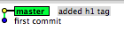

# GitHub notes <!-- omit from toc -->

 **Git** is a revision control system, a **tool** to manage your source code history on your local machine. Git has a pretty steep learning curve compared to many other systems. It is a painstaking process. For more information, see [GitNotes](GitNotes.md).

> [!NOTE]
> **Git** is a revision control system, a **tool** to manage your
source code history. **GitHub** is a hosting service for Git
repositories. They are not the same thing: **Git is the tool, GitHub is the service for projects that use Git**.

To shorten your GitHub file address go to
[https://git.io/](https://git.io/). (??)

- [1. Git](#1-git)
  - [1.1. Git Getting Started](#11-git-getting-started)
    - [1.1.1. Create a local Git repository via GitHub Desktop](#111-create-a-local-git-repository-via-github-desktop)
    - [1.1.2. Publish Local Git Repository to GitHub](#112-publish-local-git-repository-to-github)
    - [1.1.3. Add information to README.md](#113-add-information-to-readmemd)
- [2. GitHub](#2-github)
  - [2.1. GitHub Getting Started](#21-github-getting-started)
    - [2.1.1. Create a Repository](#211-create-a-repository)
- [3. GitHub Hello World](#3-github-hello-world)
  - [3.1. Create a Repository](#31-create-a-repository)
  - [3.2. Create a Branch](#32-create-a-branch)
  - [3.3. Commit Changes](#33-commit-changes)
  - [3.4. Open a Pull Request](#34-open-a-pull-request)
  - [3.5. Merge Pull Request](#35-merge-pull-request)
- [4. Glossary](#4-glossary)
- [5. Custom Styles](#5-custom-styles)
- [6. Appendix](#6-appendix)
  - [6.1. Appendix A - TBD](#61-appendix-a---tbd)
- [7. - 1. Git](#7---1-git)
- [8. References](#8-references)

## 1. Git

**Git** is a revision control system, a **tool** to manage your source code history.

### 1.1. Git Getting Started

The first steps you want to perform is to install **Git**.  

1. We reccomend you install the GitHub GUI client from this location: [GitHub Desktop](https://desktop.github.com/). This tool provides a very friendly GUI and seamless integration with your GitHub repositories. So, go for it!! For more information, see [GitHub Desktop Documentation](https://help.github.com/en/desktop).
1. Alternatively, you can install the Git command line tool, refer to [Getting Started - Installing Git](https://git-scm.com/book/en/v2/Getting-Started-Installing-Git).

#### 1.1.1. Create a local Git repository via GitHub Desktop

1. Activate the Git client.
2. From the File drop-down menu, select **Create a New Repository**
3. In the popup dialog window enter the required information. The following picture shows an examnple:

4. Click the **Create Repository** button. This is an example of the results:

5. Click the **preferences** link and enter your GitHub account information. For more information, see [Configuring Git for GitHub Desktop](https://help.github.com/en/desktop/getting-started-with-github-desktop/configuring-git-for-github-desktop).
6. Configure your default editor. We have selected *VS Code* for our examples, as shown in the next picture. For more information, see [Configuring a default editor](https://help.github.com/en/desktop/getting-started-with-github-desktop/configuring-a-default-editor).

#### 1.1.2. Publish Local Git Repository to GitHub

1. If not done yet, click the **preferences** link and enter your GitHub account information. For more information, see [Configuring Git for GitHub Desktop](https://help.github.com/en/desktop/getting-started-with-github-desktop/configuring-git-for-github-desktop).
1. In the right pane, click the **Publish repository** button.
1. In the popup dialog, uncheck *Keep this code private*, if you wish; click the **Publish repository** button.
1. Click the **View on GitHub** button to verify that the repo has been created in GitHub.

#### 1.1.3. Add information to README.md

~~ 1. In your favorite markdown editor, edit the **README.md** file and add meaningful information about the project. I use [MacDown](https://macdown.uranusjr.com/) as the markdown editor on a Mac laptop. ~~
~~2. In your Git client you will see in green the content added to the file. Verify that everything is correct.~~
~~3. In the left pane, add a comment about the changes you made.~~
~~4. Click the **Commit to master** button.~~
~~5. In the right pane, click the **Push origin** button. This publishes the file to your GitHub repository. ~~ 

> [!WARNING]  
> Use [GitHub desktop](https://desktop.github.com/)  desktop instead .

## 2. GitHub

[GitHub](https://github.com/) is a hosting service for Git repositories. It is a hosting platform for version control and collaboration. It allows people to work on common projects from everywhere.

### 2.1. GitHub Getting Started

This section shows how to get started with GitHub. In particular it demonstrates how to:

- [Create a repository](#repo)
- Start and manage a new branch
- Make changes to a file and push them to GitHub as commits
- Open and merge a pull request

#### 2.1.1. Create a Repository

A repository is usually used to organize a single project. Repositories can contain folders and files, images, videos, spreadsheets, and data sets; anything your project needs. It is recommended to include a README, or a file with information about your project. GitHub makes it easy to add one at the same time you create your new repository. It also offers other common options such as a license file.

Your repository can be a place where to store ideas, resources, or even share and discuss things with others.

1. Login in your [GitHub](https://github.com) account.
1. Click the **Repositories** tab.
1. Click the **New** button at the botoom of the page.
1. In the text box enter the name of the project for example: *git-notes*.
1. Optionally, enter a description for the project.
1. Check the Public selection.
1. Check "Initialize this repository with a **README**.
1. If needed, add a **LICENSE** file
1. Click the **Create repository** button.
The following picture shows an example of a repository creation:

## 3. GitHub Hello World

The Hello World project is a simple exercise that gets you started when learning something new. Let’s get started with GitHub! For more info, see [Hello World](https://guides.github.com/activities/hello-world/).
This example uses GitHub which is a code hosting platform for version control and collaboration. It allows people to work on common projects from everywhere.

You’ll learn how to:

- Create and use a repository
- Start and manage a new branch
- Make changes to a file and push them to GitHub as commits
- Open and merge a pull request

### 3.1. Create a Repository

A repository is usually used to organize a single project. Repositories can contain folders and files, images, videos, spreadsheets, and data sets; anything your project needs. It is recommended to include a README, or a file with information about your project. GitHub makes it easy to add one at the same time you create your new repository. It also offers other common options such as a license file.

Your hello-world repository can be a place where to store ideas, resources, or even share and discuss things with others.

1. Login on your [GitHub](https://github.com) account.
2. In the upper right corner, click the **New** button.
3. Name your repository **hello-world**.
4. Click the **Create repository** button at the botoom of the page.
4. Write a short description. Select Initialize this repository with a **README**.
5. If needed add a **LICENSE** file

### 3.2. Create a Branch

Branching is the way to work on different versions of a repository at one time.
By default the repository has one branch named **master** which is considered to be the definitive branch.

Let's use branches to experiment and make edits before committing them to master.

1. Go to the repository **hello-world**.
2. Click the drop-down on the upper left at the top of the file list that says **Branch: master**.
3. Type the branch name *readme-edits* into the new branch text box.
4. Select the blue **Create branch** box or click **Enter** on your keyboard.

### 3.3. Commit Changes

Now, you’re on the code view for your readme-edits branch, which is a copy of master. You know that you are in the new branch from the drop-down on the upper left on the top of the file list **Branch: readme-edits**. As matter of fact, from the drop-down you can switch between branches, i.e. *master* and *readme-edits* in our case.
Let’s make some edits in the *readme-edits* branch.

1. Click the *README.md* file.
1. Click the  pencil icon in the upper right corner of the file view to edit.
1. In the editor, write a bit about yourself.
Write a commit message that describes your changes.
1. Click **Commit** changes button at the end of the page.

These changes will be made to just the README file in the *readme-edits* branch, so now this branch contains content that’s different from master.

### 3.4. Open a Pull Request

Now that we have changes in a branch off of master, you can **open a pull request**.

**Pull Requests** are the heart of collaboration on GitHub.

When you open a pull request, you’re proposing your changes and requesting that someone review and pull in your contribution and merge them into their branch.
Pull requests show diffs, or differences, of the content from both branches. The changes, additions, and subtractions are shown in green and red.

Note the following:

1. As soon as you make a commit, you can open a pull request and start a discussion, even before the code is finished.
1. By using GitHub’s `@mention system` in your pull request message, you can ask for feedback from specific people or teams, whether they’re down the hall or 10 time zones away.
1. You can even open pull requests in your own repository and merge them yourself. It’s a great way to learn the GitHub flow before working on larger projects.

Let's see how it is done:

1. While in the *README* file, in the *readme-edits* branch, click the **Pull Request** tab at the very top.
1. Click the **New pull request** button.  
1. In the **Example Comparisons** box, select the branch you made, *readme-edits*, to compare with master (the original).
1. Look over your changes in the diffs on the **Comparing changes** page, assure that they are what you want to submit.
1. When you’re satisfied, click the **Create Pull Request** button in the top left. To discuss and review the changes in this comparison with others.
1. Give your pull request a title and write a brief description of your changes.
1. Click the **Create pull request** button at the bottom of the page.

### 3.5. Merge Pull Request

In this final step, it’s time to bring your changes together by merging your *readme-edits* branch into the *master* branch.

1. Click the green **Merge pull request** button to merge the changes into master.
1. Click **Confirm** merge.
1. Go ahead and delete the branch, since its changes have been incorporated, with the **Delete branch** button in the purple box.

To learn more about the power of **Pull Requests**, we recommend reading the [GitHub flow Guide](http://guides.github.com/overviews/flow/). You might also visit [GitHub Explore](http://github.com/explore) and get involved in an Open Source project.

Check out our other [Guides](http://guides.github.com/), [YouTube Channel](http://youtube.com/githubguides) and [On-Demand Training](https://services.github.com/on-demand/) for more on how to get started with GitHub.

## 4. Glossary

- **Repository**. It is a collection of commits, each of which is an archive of what the project’s working tree looked like at a past date, whether on your machine or someone else’s. It also defines **HEAD** which identifies the branch or commit the current working tree stemmed from. Lastly, it contains a set of branches and tags, to identify certain commits by name.
- **Commit**. A commit is a snapshot of your working tree at some point in time. The state of HEAD at the time your commit is made becomes that commit’s parent. This is what creates the notion of a **revision history**.
- **Index**. Git does not commit changes directly from the working tree into the repository. Instead, it registers them in the **index**. It is a way of “confirming” your changes, one by one, before doing a commit, which records all your approved changes at once. Some call it the **staging area**, instead.
- **Working tree**. A working tree is any directory on your filesystem which has a repository associated with it, typically indicated by the presence of a sub-directory within it named **.git.**. It includes all the files and sub-directories in that directory.
- **Branch**. A branch is just a name for a commit. It is also called a reference. It is the parentage of a commit which defines its history, and thus the typical notion of a “branch of development”.
- **Tag**. A tag is also a name for a commit, similar to a branch, but it always refers to the same commit. It can have its own description text.
- **Master** The mainline of development in most repositories is done on a branch called “**master**”. Although this is a typical default, there is nothing special about this branch.
- **HEAD** It is used by the repository to define what is currently checked out, specifically:
  - If you checkout a branch, HEAD symbolically refers to that branch, indicating that the branch name should be updated after the next commit operation.
  - If you checkout a specific commit, HEAD refers to that commit only. This is referred to as a detached HEAD, and occurs, for example, if you check out a tag name.

## 5. Custom Styles

The technique shown in [Custom Styles](#custom_styles) section work on your local machine, 'cause the style *custom.css* file is local, in the case of Jupyter Notebooks. But it does not work if you publish the file on a public server such as Anaconda cloud. The ideal thing is to have the *custom.css* file available globally. The best solution, in the case of Jupyter Notebooks (and Anaconda cloud) is to define the custom styles locally in your markdown file as you can see next, if you display this cell in edit mode.

<code language="xml">

 
Yellow

 
Red

  
 
Green

 
Blu

</code>  

## 6. Appendix

### 6.1. Appendix A - TBD

## 7. - [1. Git](#1-git)

## 8. References

|Link|Description|
|----|-----------|
|[GitHub Guides](http://guides.github.com/) |GitHub basic components|
|[https://git.io/](https://git.io/)|Shorten your GitHub address|
