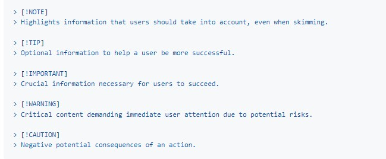

# Markdown Syntax <!-- omit from toc -->

The [Markdown
Cheatsheet](https://github.com/adam-p/markdown-here/wiki/Markdown-Cheatsheet){:target="_blank"
rel="noopener"} used in this topic is intended as a quick reference and
showcase. For more complete info, see [John Gruber's original
spec](http://daringfireball.net/projects/markdown/) and the [Github-flavored
Markdown](http://github.github.com/github-flavored-markdown/).

> [!NOTE] See also a [Cheatsheet specific to Markdown
> Here](https://github.com/adam-p/markdown-here/wiki/Markdown-Here-Cheatsheet)
> if that's what you're looking for. You can also check out more [Markdown
> tools](https://github.com/adam-p/markdown-here/wiki/Other-Markdown-Tools).

- [1. Create Links](#1-create-links)
- [2. Alerts](#2-alerts)
- [3. Emoji Icons](#3-emoji-icons)
- [4. References](#4-references)

## 1. Create Links

To open a link in a different window use the following syntax:
`{:target="_blank" rel="noopener"}`.  For example: [Markdown
Cheatsheet](https://github.com/adam-p/markdown-here/wiki/Markdown-Cheatsheet){:target="_blank"
rel="noopener"}.  See also: [using rel="noreferer" without rel="noopener" or
without
target="_blank"](https://security.stackexchange.com/questions/241559/using-rel-noreferer-without-rel-noopener-or-without-target-blank){:target="_blank"
rel="noopener"}

## 2. Alerts

Alerts are an extension of Markdown used to emphasize critical information. On GitHub, they are displayed with distinctive colors and icons to indicate the importance of the content.

The following is the syntax for the alerts:

The following example shows all five alert types.

> [!NOTE]  
> Highlights information that users should take into account, even when skimming.

> [!TIP]
> Optional information to help a user be more successful.

> [!IMPORTANT]  
> Crucial information necessary for users to succeed.

> [!WARNING]  
> Critical content demanding immediate user attention due to potential risks.

> [!CAUTION]
> Negative potential consequences of an action.

See also [An option to highlight a "Note" and "Warning" using blockquote
(Beta)](https://github.com/orgs/community/discussions/16925){:target="_blank"
rel="noopener"}.

## 3. Emoji Icons

[emoji cheat sheet](https://github.com/ikatyang/emoji-cheat-sheet/blob/master/README.md {:target="_blank" rel="noopener"}).

## 4. References

- [Markdown
  Cheatsheet](https://github.com/adam-p/markdown-here/wiki/Markdown-Cheatsheet)
- [Writing on GitHub](https://docs.github.com/en/get-started/writing-on-github)
  - [Basic writing and formatting syntax](https://docs.github.com/en/get-started/writing-on-github/getting-started-with-writing-and-formatting-on-github/basic-writing-and-formatting-syntax)
- [Markdown cheatsheet](https://github.com/adam-p/markdown-here/wiki/Markdown-Here-Cheatsheet)
- [Markdown tools](https://github.com/adam-p/markdown-here/wiki/Other-Markdown-Tools)
- [An option to highlight a "Note" and "Warning" using blockquote (Beta)](https://github.com/orgs/community/discussions/16925)
-[Markdown and Visual Studio Code](https://code.visualstudio.com/docs/languages/markdown)
