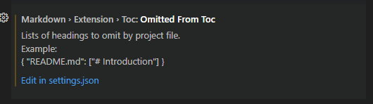

# Tools <!-- omit from toc -->

The **Tools** folder contains information about tools to use to create content for *programming* topics.  

- [1. GitHub desktop](#1-github-desktop)
- [2. Visual studio code](#2-visual-studio-code)
  - [2.1. Installed extensions](#21-installed-extensions)
- [3. References](#3-references)

## 1. GitHub desktop

 Focus on what
matters instead of fighting with Git. Whether you're new to Git or a
seasoned user, GitHub Desktop simplifies your development workflow. You
can download the desktop app at this location: [GitHub
Desktop](https://desktop.github.com/). 

See [README](../GitHub/README.md).  

## 2. Visual studio code

This folder contains information about the **Visual Studio Code** tool.
Visual Studio Code is a lightweight but powerful source code editor that
runs on your desktop and is available for Windows, macOS and Linux. It
comes with built-in support for JavaScript, TypeScript and Node.js and
has a rich ecosystem of extensions for other languages and runtimes
(such as C++, C#, Java, Python, PHP, Go, and .NET). 

See [README](./Visual%20Studio%20Code/README.md). 

### 2.1. Installed extensions

1. **Markdown All in One**. All you need to write Markdown (keyboard shortcuts,
   table of contents, auto preview and more). [VS Marketplace
   Link](https://marketplace.visualstudio.com/items?itemName=yzhang.markdown-all-in-one).

   - In the file `C:\Users\miele\AppData\Roaming\Code\User\settings.json` set the following: `"markdown.extension.toc.orderedList": false` to avoid the automatic numbering of the TOC entries. Otherwise the numbering conflicts with the numbering you get when in the palette you use the command:  `Markdown All in One: Add/Update section numbers`. 
   You can get to the `settings.json` file via the *Markdown All in One settings*. Use the *Settings* gear, then look for *Omitted from Toc*, finally select the link: `Edit in settings.json`. 
   .
   See also the extension documentation at: [Markdown All in One Documentation](https://markdown-all-in-one.github.io/docs/).
1. **markdownlint**. markdownlint is an extension for the Visual Studio
   Code editor that includes a library of rules to encourage standards
   and consistency for Markdown files.
   [markdownlint](https://marketplace.visualstudio.com/items?itemName=DavidAnson.vscode-markdownlint)
1. **Rewrap**. Hard wrapping for comments and other text in a given
   column. [VS Marketplace
   Link](https://marketplace.visualstudio.com/items?itemName=stkb.rewrap).
   See the [setting.json](../Tools/.vscode/settings.json) file for the
   column wrap value. See also [User and Workspace
   Settings](https://code.visualstudio.com/docs/getstarted/settings)
1. **Python**. A [Visual Studio Code
   extension](https://marketplace.visualstudio.com/VSCode) with rich
   support for the [Python language](https://www.python.org/) (for all
   [actively supported Python
   versions](https://devguide.python.org/versions/#supported-versions)),
   providing access points for extensions to seamlessly integrate and
   offer support for IntelliSense (Pylance), debugging (Python
   Debugger), formatting, linting, code navigation, refactoring,
   variable explorer, test explorer, and more!

   The Python extension will automatically install the following extensions by default to provide the best Python development experience in VS Code:
   1. [Pylance](https://marketplace.visualstudio.com/items?itemName=ms-python.vscode-pylance)
      to provide performant Python language support 
   1. [Python
        Debugger](https://marketplace.visualstudio.com/items?itemName=ms-python.debugpy)
        to provide a seamless debug experience with debugpy
1. **Python Indent**. Correct Python indentation in Visual Studio Code.
   See also [Python
   Indent](https://marketplace.visualstudio.com/items?itemName=KevinRose.vsc-python-indent).

> [!NOTE]  
> To use the Python extension you must [install a supported version of
> Python](https://code.visualstudio.com/docs/python/python-tutorial#_prerequisites)
> on your system (note: that the system install of Python on macOS is
> not supported). Check that the installation works by opeing or
> creating a Python file and start coding!

## 3. References

- [Getting started with VS code and download](https://code.visualstudio.com/docs/?dv=win64user)
- [Getting started with VS code and download](http://stackoverflow.com){:target="_blank" rel="noopener"}
- [Github Markdown basic writing and formatting
  syntax](https://docs.github.com/en/get-started/writing-on-github/getting-started-with-writing-and-formatting-on-github/basic-writing-and-formatting-syntax#lists)
- [Getting Started with Python in VS Code](https://code.visualstudio.com/docs/python/python-tutorial#_prerequisites)
